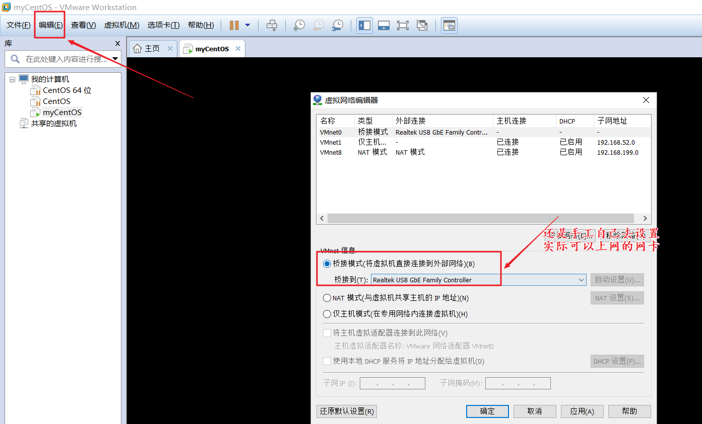

# 扩展

## 把本地的光盘设置为本地的yum源

1. 挂载光盘

   ```
   # mount /dev/cdrom /mnt/cdrom
   ```

2. 备份本地的远程yum文件，启用镜像yum源配置文件

   ```
   root@localhost yum.repos.d]# mv /etc/yum.repos.d/CentOS-Base.repo /etc/yum.repos.d/CentOS-Base.repo.back
   
   [root@localhost yum.repos.d]# vim /etc/yum.repos.d/CentOS-Media.repo 
   
   [c5-media]
   name=CentOS-$releasever - Media
   baseurl=file:///mnt/cdrom/CentOS/
           file:///mnt/cdrom/
           file:///mnt/cdrom/cdrecorder/
   gpgcheck=1
   enabled=1
   gpgkey=file:///etc/pki/rpm-gpg/RPM-GPG-KEY-CentOS-5
   
   
   ```

3. 直接使用yum进行安装

   ```
   # yum install -y 软件名称
   ```


## samba

有的时候我们为了把本地电脑电脑里面文件上传到远端的服务器上。

1. ftp服务器（vsftpd软件）企业使用的还是很多 （21端口）
2. lrzsz小工具（个人最信息）rz上传   sz 下载的文件
3. xftp xshell公司单独出的一款上传工具（高版本的xshell自己集成，可以单独去安装），使用传输的协议 sftp协议（基于 ssh 协议  22端口）


### 简介

有的时候在开发的环境中，是多种操作系统环境交叉使用，例如，Windows的电脑做开发，linux电脑做服务器，彼此之间需要相关的传递文件，共享信息。彼此沟通非常麻烦。这个时候可以使用一个叫做 Samba（作者和linux是同样有名）的软件完美的解决彼此之间的沟通。(linux  git三个星期)。注意：软件默认情况下只能在局域网使用。一般来说不建议这样，本身设计的目的就是为了局域网多文件系统进行文件传输。


### 使用

1. 使用yum安装Samba软件

   ```
   # yum install -y samba
   
   ```

2. 添加一个系统用户，等会配合Samba软件一起使用

   ```
   # useradd sambatest
   # passwd sambatest
   
   ```

3. 添加上一步的用户到Samba服务里面

   ```
   # smbpasswd  -a  sambatest(将系统用户加入Samba的配置文件中，并为该用户设置密码)
   
   ```

4. 启动Samba服务

   ```
   # service smb start
   
   ```

5. Windows连接Samba服务的服务器

   ```
   window+r
   
   输入
   \\linux服务器IP地址
   
   ```


## Sudo= super do

### 简介

可以用**root的身份**去执行一个命令，主要是**为辅助超级管理员**完成一些超级管理员不能登录下的操作。因为在实际的生产环境，root一般是很少连接远程连接服务器的，root权限过大，一般来说都是以普通用户进行登录管理，但是有的时候普通用户也想执行一下root用户的权限（例如服务器重启），该怎么办呢？

Ubuntu操作系统里面是不建议使用root用户的，会添加一个普通的用户，如果要执行一个root才可以执行的命令，则需要在该命令之前加上一个 sudo

```
# sudo reboot

# sudo apt-get install vsftpd

```


### 使用

1. 查看sudo信息

   ```
   # visudo -V
   
   
   ```

   如果不能显示上面的信息，使用如下方式进行安装

2. 安装sudo软件

   ```
   # yum install -y sudo
   
   ```

3. 编辑配置文件，使得一个普通用户可以使用root的身份去执行一些root才能操作的命令（例如关机 shutdown、 useradd）修改的其实是 /etc/sudoers文件

   ```
   # visodu 
    andy ALL=(ALL) /sbin/reboot
    test ALL=(ALL)  /usr/sbin/useradd
    
   
   ```

4. 切换成普通用户，执行命令

   ```
   # su - test
   
   
   命令执行
   # sudo /usr/sbin/useradd 
   
   提示输入 test 的密码，千万注意不是root的密码，如果成功，这条命令立马执行。
   
   
   ```

   注意：需要输入普通用户的密码


# 网络相关的命令

1. ifconfig 查看linux的ip地址信息
2. service network restart 重启我们的网卡【在本地使用的时候，会使用】由于我们本地使用的是桥接方式，则在重启的时候，我们宿主机所处的交换机，则会给我们的虚拟电脑通过 dhcp 服务分配一个和宿主机同一网络的IP地址。注意：通过dhcp 分配IP，每一次分配的时候，都有可能不一样。【交换机一般都有记忆功能 交换机通过查询自己的缓存系统，发现当前要分配的电脑的mac与之对应的IP地址是存在，并且该IP地址是没有分配给其他的用户，则里面把这个IP地址分配给当前用户】


# VMware 知识


1. 桥接：虚拟电脑和自己的宿主机完全是同一个网络，并且对整个局域网来说，是无法得知这台虚拟电脑是否是虚拟处理。统一看来都是真的。

2. host-only方式：这个时候虚拟电脑只能和宿主机进行通信，对局域网是不可知。这个时候VMware软件会做两件事

   1. 给我们宿主机电脑虚拟出来一块网卡，然后也会分配一个IP地址。（是通过VMware软件本身进行分类，这个时候VMware这个软件就相当于是一个交换机）
   2. 还会给虚拟电脑分配一个和上面虚拟网卡同一网段的IP地址。
   3. 注意：上面分配的IP地址和我们宿主机电脑局域网的IP地址是完全没有关系，所以虚拟机这个时候对外是不可见，一般在大的测试环境。要保证每个用户可以有足够的IP地址进行测试，并且之间不要相互影响。

3. nat转换

   1. 可以把虚拟机的数据包进行重新做地址封装，基于的是VMware这个软件提供的一个nat服务。


注意：我们的虚拟机里面的网卡其实是有对应的配置文件。知道一下即可，不要尝试手工的去修改它，因为修改没有实际的意义。

1. 生成环境里面的IP地址都是公网IP地址，不需要自己去设置。

2. 在本地测试，也不要关闭dhcp，去使用自己去手工的设置IP地址，因为手工设置的IP地址很容易造成冲突。（192.168.93.82）

   ```
   IPADDR=192.168.93.82
   
   # service network restart （立马 IP地址冲突）
   ```

   ```
   # cat /etc/sysconfig/network-scripts/ifcfg-eth0
   
   # Advanced Micro Devices [AMD] 79c970 [PCnet32 LANCE]
   DEVICE=eth0
   BOOTPROTO=dhcp
   # 手工分配
   #BOOTPROTO=static
   #IPADDR=192.168.93.83
   # mac地址 底层的通信全部都是mac arp iarp协议 ip地址和mac转换
   HWADDR=00:0C:29:AD:6D:2F
   # 开启启动 no
   ONBOOT=yes
   
   
   ```


# 回家后的网络问题

1. 大家使用的桥接方式的网卡可能发生了变化（教室：有线网卡 WiFi：无线网卡），VMware默认情况桥接是自动模式，自己去选择网卡。

   

2. 有的同学虚拟机是挂起， 在重新激活的时候，还是使用的原来的ip地址，并没有通过dhcp服务分配最新的IP地址

   方式一：

   ```
   # reboot
   ```

   方式二：（多次试一试）

   ```
   # service network restart
   
   # ifconfig 
   ```


